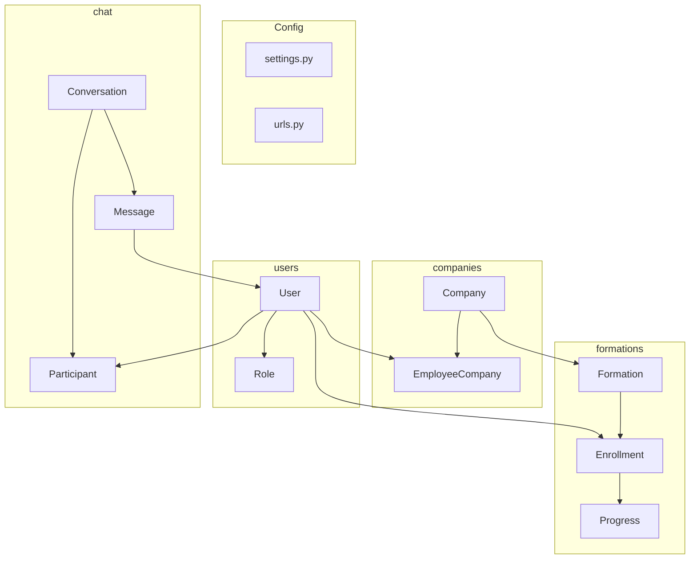

# Architecture du repo

Ce document decrit la structure cible du projet et la repartition des responsabilites entre les apps Django.

## Vue d'ensemble

Le repo est organise pour separer:

- le backend Django dans `backend/`
- le frontend dans `frontend/`
- la documentation dans `docs/`

L'objectif est d'avoir une base simple, lisible et facile a maintenir.

## Arborescence cible

```text
portfolio-MDE_dashboard/
├── backend/
│   ├── config/
│   ├── users/
│   ├── companies/
│   ├── formations/
│   ├── chat/
│   └── manage.py
├── frontend/
├── docs/
│   ├── ARCHITECTURE_REPO.md
│   ├── GUIDE_DJANGO.md
│   ├── Stage-1.MD
│   └── Stage-2.MD
├── README.md
└── .gitignore
```

## Role de chaque dossier

### `backend/`

Contient toute la partie Python / Django.

On y trouve:

- la configuration du projet Django
- les applications metier
- les modeles
- les vues
- les routes
- les migrations

#### Base de donnees

En developpement, la base locale reste dans `backend/`:

- `backend/db.sqlite3`

En production, le projet pourra utiliser une base externe comme PostgreSQL.

Regles importantes:

- ne pas mettre la base dans `docs/`
- ne pas versionner `db.sqlite3`
- garder les structures dans `models.py`
- garder les changements de schema dans `migrations/`

#### `backend/manage.py`

Point d'entree des commandes Django.

Exemples:

- `python manage.py runserver`
- `python manage.py makemigrations`
- `python manage.py migrate`
- `python manage.py createsuperuser`

#### `backend/config/`

Dossier de configuration du projet Django.

- `settings.py`: configuration globale du projet
- `urls.py`: routes principales
- `asgi.py`: entree ASGI
- `wsgi.py`: entree WSGI

#### `backend/users/`

App Django pour les utilisateurs et les roles.

Responsabilite:

- gerer le compte utilisateur
- stocker le prenom et le nom
- definir le role global

Modeles cles:

- `User`: utilisateur du systeme
- `Role`: `SuperAdmin`, `Admin`, `Employee`

Regle metier:

- chaque utilisateur a un seul role global

#### `backend/companies/`

App Django pour les entreprises et l'affectation des employes.

Responsabilite:

- creer et gerer les entreprises
- relier un utilisateur a une ou plusieurs entreprises
- gerer les relations employe-entreprise

Modeles cles:

- `Company`: une entreprise
- `EmployeeCompany`: liaison many-to-many entre `User` et `Company`

Regles metier:

- une entreprise peut avoir plusieurs employes
- un employe peut appartenir a plusieurs entreprises

#### `backend/formations/`

App Django pour les formations et les inscriptions.

Responsabilite:

- creer et gerer les formations
- inscrire des employes a une formation
- suivre l'avancement

Modeles cles:

- `Formation`: une formation rattachee a une entreprise
- `Enrollment`: liaison entre `User` et `Formation`
- `Progress`: suivi de l'avancement

Regles metier:

- une formation peut avoir plusieurs employes inscrits
- un employe peut suivre plusieurs formations en parallele

#### `backend/chat/`

App Django pour le chat instantane global.

Responsabilite:

- gerer les conversations
- gerer les messages
- gerer les participants

Modeles cles:

- `Conversation`: conversation individuelle ou de groupe
- `Message`: message envoye dans une conversation
- `Participant`: liaison entre `User` et `Conversation`

Regles metier:

- tous les employes peuvent parler entre eux
- le chat n'est pas limite par entreprise

### `frontend/`

Dossier reserve a l'interface utilisateur.

Il pourra contenir plus tard:

- React ou un autre framework frontend
- composants UI
- pages
- appels API vers Django

### `docs/`

Documentation du projet.

On y met:

- la structure du projet
- les regles d'architecture
- les guides d'apprentissage
- les etapes de developpement

### `README.md`

Point d'entree pour comprendre rapidement le projet.

Il doit contenir:

- le nom du projet
- une courte description
- les instructions d'installation
- les commandes utiles

### `.gitignore`

Liste des fichiers et dossiers a ne pas versionner.

Exemples:

- `.venv/`
- `__pycache__/`
- `db.sqlite3`
- fichiers d'environnement
- caches d'outils

## Comment le projet fonctionne

Le flux general est le suivant:

1. L'utilisateur envoie une requete HTTP
2. Django consulte `config/urls.py`
3. La requete est envoyee vers une vue dans l'app concernee
4. La vue traite la logique metier
5. Si besoin, la vue lit ou ecrit des donnees via les modeles de l'app
6. Django renvoie une reponse HTTP ou JSON

## Ou mettre la logique

- `users/models.py`: utilisateur et role
- `companies/models.py`: entreprise et liaison employe-entreprise
- `formations/models.py`: formations, inscriptions, progression
- `chat/models.py`: conversations, messages, participants
- `config/settings.py`: configuration globale
- `migrations/`: historique des changements

## Architecture des applications



## Relations principales

```text
User
  ├── Role (1 seul role global)
  ├── EmployeeCompany (0 ou plusieurs entreprises)
  ├── Enrollment (0 ou plusieurs formations)
  └── Participant (0 ou plusieurs conversations)

Company
  ├── EmployeeCompany (plusieurs employes)
  └── Formation (plusieurs formations)

Formation
  └── Enrollment (plusieurs employes inscrits)

Conversation
  ├── Participant (plusieurs users)
  └── Message (plusieurs messages)
```

## Roles et acces

Les roles sont geres dans `users/`.

### SuperAdmin

- gere tout le systeme
- peut gerer les entreprises
- peut gerer les admins
- voit l'ensemble des donnees

### Admin

- gere une ou plusieurs entreprises
- peut gerer les employes relies a ses entreprises
- peut gerer les formations de ses entreprises

### Employee

- appartient a une ou plusieurs entreprises
- peut s'inscrire aux formations
- peut utiliser le chat global
- peut voir les employes de ses entreprises

## Regles de structure

- une responsabilite par app
- une responsabilite par fichier
- la configuration dans `config/`
- la logique metier dans les apps
- les donnees dans `models.py`
- les routes dans `urls.py`
- les tests dans `tests.py`

## Checklist d'initialisation

Quand tu crees ou modifies une app:

- [ ] l'app est enregistree dans `INSTALLED_APPS`
- [ ] les modeles sont definis dans `models.py`
- [ ] `python manage.py makemigrations` est execute
- [ ] `python manage.py migrate` est execute
- [ ] les modeles sont enregistres dans `admin.py` si utile
- [ ] les vues et routes sont creees si necessaire
- [ ] les tests sont ecrits dans `tests.py`

## Lecture conseillee

Si tu decouvres le repo, lis dans cet ordre:

1. `README.md`
2. `backend/manage.py`
3. `backend/config/settings.py`
4. `backend/config/urls.py`
5. `backend/users/models.py`
6. `backend/companies/models.py`
7. `backend/formations/models.py`
8. `backend/chat/models.py`

## Resume

L'architecture actuelle est volontairement simple:

- `users` pour les utilisateurs et les roles
- `companies` pour les entreprises et leurs employes
- `formations` pour les cours et inscriptions
- `chat` pour la messagerie globale
- `frontend` pour l'interface a venir

Cette structure est adaptee a un projet etudiant qui doit rester maintenable en production.
