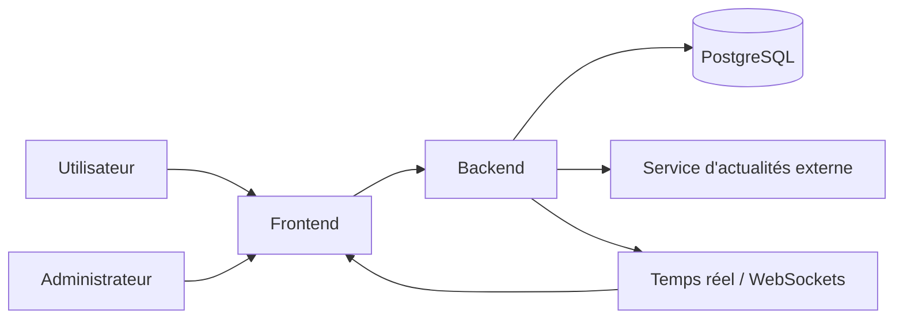
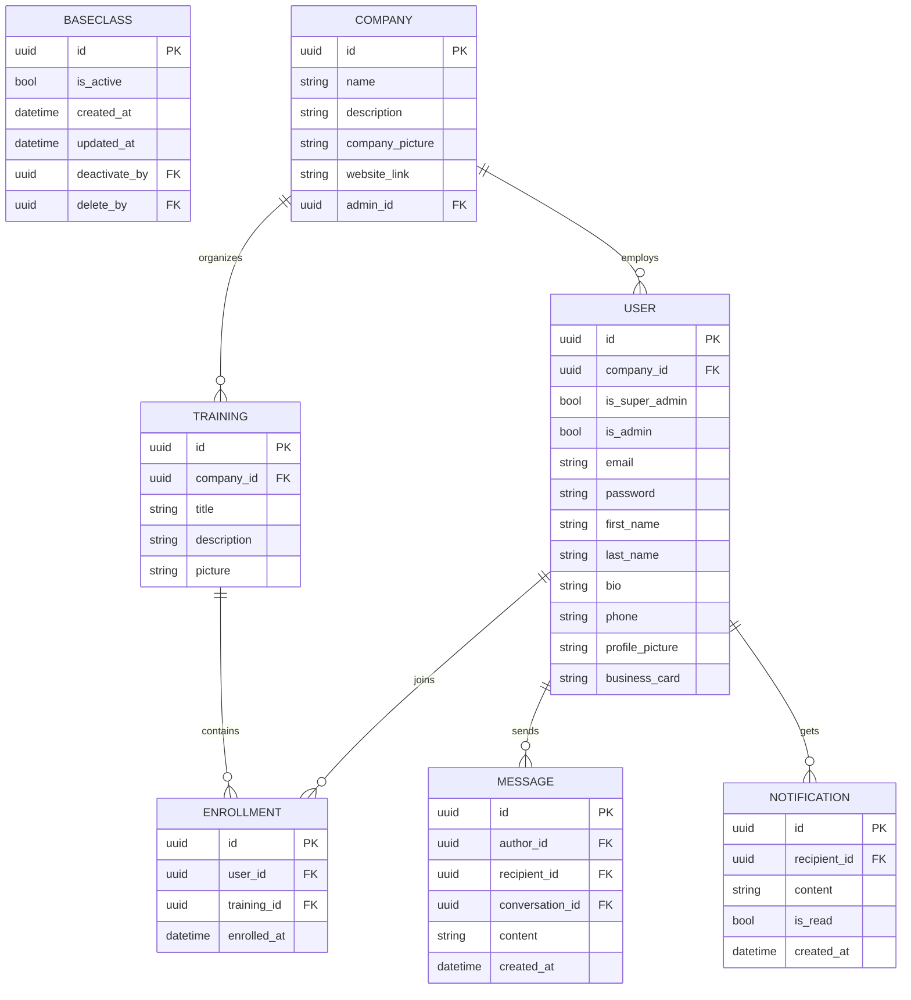
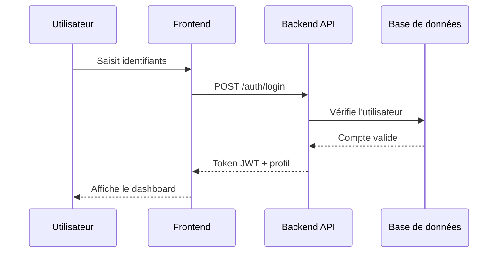
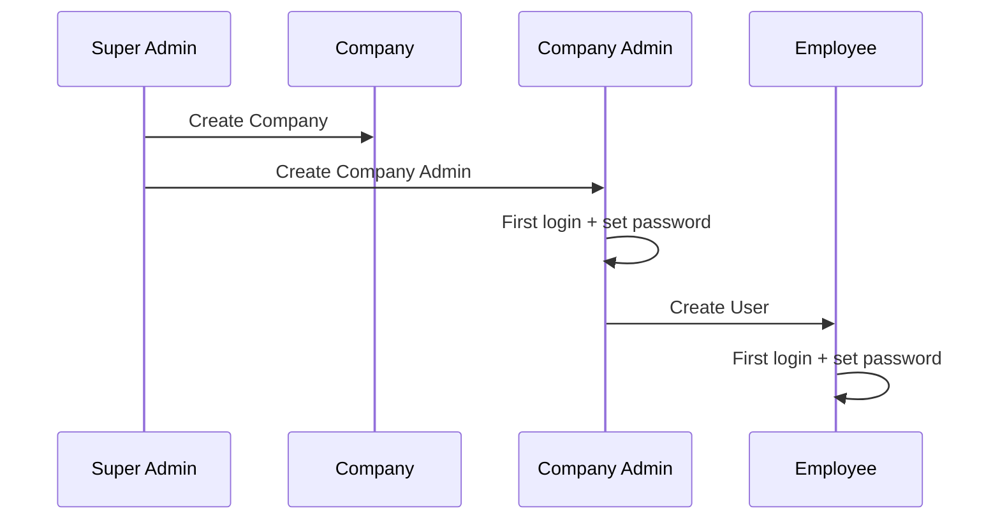
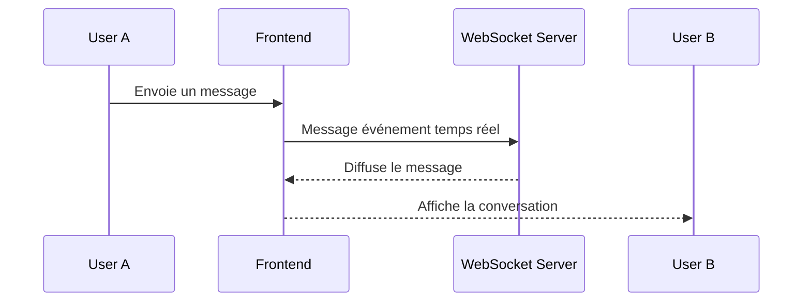

# Stage 3 — Documentation Technique

## 1. User Stories

La méthode de priorisation retenue est **MoSCoW**.

| Priorité    | User Story                                                                                                                  |
| ----------- | --------------------------------------------------------------------------------------------------------------------------- |
| Must Have   | En tant qu’utilisateur, je veux me connecter de manière sécurisée afin d’accéder à mon espace personnel.                    |
| Must Have   | En tant qu’utilisateur, je veux consulter l’annuaire des entreprises et des employés afin d’identifier les contacts utiles. |
| Must Have   | En tant qu’employé, je veux consulter les formations disponibles afin de progresser.                                        |
| Must Have   | En tant qu’utilisateur, je veux envoyer et recevoir des messages afin d’échanger avec d’autres membres.                     |
| Must Have   | En tant qu’utilisateur, je veux consulter des actualités économiques afin de rester informé.                                |
| Must Have   | En tant qu’administrateur, je veux gérer les utilisateurs et les entreprises afin d’administrer la plateforme.              |
| Should Have | En tant qu’utilisateur, je veux rechercher rapidement un contenu afin de gagner du temps.                                   |
| Should Have | En tant qu’utilisateur, je veux modifier mon profil afin de garder mes informations à jour.                                 |
| Could Have  | En tant qu’utilisateur, je veux recevoir des notifications pour les événements importants afin de ne rien manquer.          |
| Could Have  | En tant qu’administrateur, je veux consulter des statistiques d’usage afin de suivre l’adoption du produit.                 |
| Won’t Have  | En tant qu’utilisateur, je veux une application mobile native afin d’utiliser la plateforme sur téléphone.                  |

## 2. Maquette

<table>
  <tr>
    <td></td>
    <td></td>
    <td></td>
  </tr>
  <tr>
    <td></td>
    <td></td>
    <td></td>
  <tr>
</table>

## 3. Architecture du système

L’architecture retenue dans la documentation est une architecture web classique avec séparation claire entre frontend, backend, base de données et temps réel.



### 3.1 Choix d’architecture

- **Frontend** : React / Tailwind CSS pour l’interface et la navigation.
- **Backend** : API REST / Flask pour les opérations métier.
- **Base de données** : PostgreSQL pour la persistance.
- **Temps réel** : WebSockets pour la messagerie.
- **Sécurité** : authentification JWT et contrôle par rôle.

## 4. Composants, classes et modèle de données

Les principaux composants métier identifiés sont :

- utilisateurs,
- entreprises,
- formations,
- inscriptions,
- messages,
- actualités,
- notifications.

### 4.1 Entités principales

- **User** : UUID, email utilisé comme identifiant de connexion Django, username aligné sur email, mot de passe, rôles admin, informations de profil, statut actif et champs d’audit.
- **Company** : UUID, nom, description, image, administrateur associé, statut actif et champs d’audit.
- **Training** : UUID, titre, description, image, statut actif et champs d’audit.
- **Enrollment** : relation entre un user et une formation.
- **Message** : auteur, destinataire ou salon, contenu, date.
- **Notification** : contenu, statut de lecture, destinataire.

#### BaseClass

Toutes les entités persistantes héritent d'une `BaseClass` contenant les champs communs et d'audit afin d'éviter la duplication et d'homogénéiser le modèle :

- `uuid` / `id` (PK)
- `is_active` (bool)
- `created_at` (datetime)
- `updated_at` (datetime)
- `deactivate_by` (uuid FK)
- `delete_by` (uuid FK)

Les entités `User`, `Company`, `Training`, `Enrollment`, `Message` et `Notification` héritent de `BaseClass` et ajoutent leurs attributs métier spécifiques.

### 4.2 Diagramme ER



### 4.3 Règles de conception

- un utilisateur appartient à une seule entreprise principale,
- une formation peut avoir plusieurs inscrits,
- une inscription ne doit pas être dupliquée,
- les messages doivent être traçables,
- les données doivent être filtrées par périmètre de visibilité.

## 5. Diagrammes de séquence

Les séquences de haut niveau documentent les interactions principales du système.

### 5.1 Connexion et accès au dashboard



### 5.2 Création d’une entreprise et activation des comptes



### 5.3 Messagerie temps réel



## 6. Spécifications API

### 6.1 API externes

La documentation du projet évoque une collecte ou consultation d’actualités économiques. Cette partie peut dépendre d’une API externe de news ou d’un flux source choisi par l’équipe.

Exigences générales :

- récupérer des actualités économiques,
- filtrer par sujet ou source,
- normaliser les données avant affichage.

### 6.2 API internes — Endpoints CRUD détaillés

Conventions générales :

- Pagination: `GET` list endpoints acceptent `?page=1&per_page=20`.
- Filtrage: `?q=term`, filtres spécifiques par champ (ex: `?is_active=true`).
- Tri: `?sort=created_at,-title` (préfix `-` pour ordre descendant).
- Réponses: standard `200` (OK), `201` (Created), `204` (No Content), `400` (Bad Request), `401` (Unauthorized), `403` (Forbidden), `404` (Not Found), `409` (Conflict), `422` (Validation Error), `500` (Server Error).
- Soft delete: `DELETE` marque `is_active=false` et renseigne `delete_by` et `deleted_at` si applicable.

#### Authentification

- `POST /auth/register` — Crée un compte utilisateur (open/admin).
  - Body: `{ first_name, last_name, email, password, company_id? }`
  - Response: `201` user object (sans password).
  - Permissions: public (ou admin pour création interne).

- `POST /auth/login` — Retourne JWT + refresh token.
  - Body: `{ email, password }`
  - Response: `200` `{ access_token, refresh_token, expires_in }`.

- `POST /auth/refresh` — Rafraîchit le token.
  - Body: `{ refresh_token }`
  - Response: `200` new tokens.

- `POST /auth/logout` — Invalide le refresh token / blackliste JWT.
  - Permissions: authenticated.

#### Utilisateurs (`/users`)

- `GET /users` — Liste paginée d'utilisateurs.
  - Query: `?page&per_page&q&company_id&is_active`.
  - Response: `200` `{ items: [...], meta: { total, page, per_page } }`.
  - Permissions: admin / company-admin (scope filtered by company).

- `POST /users` — Crée un utilisateur (admin action).
  - Body: `{ first_name, last_name, email, password, company_id, roles[] }`.
  - Response: `201` user object.
  - Permissions: admin / company-admin.

- `GET /users/{id}` — Récupère un utilisateur.
  - Response: `200` user object or `404`.
  - Permissions: self or admin/company-admin.

- `PATCH /users/{id}` — Mise à jour partielle.
  - Body: partial user fields (no password unless specific endpoint).
  - Response: `200` updated user.
  - Permissions: self or admin/company-admin.

- `PUT /users/{id}` — Remplace l’utilisateur (optional; otherwise use PATCH).
  - Response: `200` updated user.

- `DELETE /users/{id}` — Soft delete.
  - Response: `204`.
  - Permissions: admin/company-admin.

- `POST /users/{id}/reset-password` — Force password reset (admin) or change (self with old password).

#### Entreprises (`/companies`)

- `GET /companies` — Liste paginée.
  - Query: `?q&is_active`.
  - Permissions: admin (public read maybe allowed for directory).

- `POST /companies` — Crée une entreprise.
  - Body: `{ name, description, website_link, company_picture, admin_id? }`.
  - Response: `201` company object.

- `GET /companies/{id}` — Détails entreprise.

- `PATCH /companies/{id}` — Mise à jour partielle.

- `DELETE /companies/{id}` — Soft delete; cascade rules: disable related trainings, notify users (business rules).

- `GET /companies/{id}/users` — Liste des utilisateurs d'une entreprise.

#### Formations (`/trainings`)

- `GET /trainings` — Liste (filter by company_id, is_active).

- `POST /trainings` — Crée une formation.
  - Body: `{ title, description, picture, company_id, is_active }`.

- `GET /trainings/{id}` — Détails.

- `PATCH /trainings/{id}` — Mise à jour partielle.

- `DELETE /trainings/{id}` — Soft delete.

- `POST /trainings/{id}/enroll` — Inscrit l'utilisateur authentifié (ou admin pour un user).
  - Body: `{ user_id? }` (omit to use current user).
  - Response: `201` enrollment object.

- `GET /trainings/{id}/enrollments` — Liste des inscrits.

- `GET /users/{id}/trainings` — Formations d'un utilisateur.

#### Inscriptions (`/enrollments`)

- `GET /enrollments` — Liste paginée, filter by `user_id`, `training_id`.

- `POST /enrollments` — Crée explicitement une inscription (admin).
  - Body: `{ user_id, training_id }`.

- `GET /enrollments/{id}` — Détails.

- `PATCH /enrollments/{id}` — Mise à jour (status, dates).

- `DELETE /enrollments/{id}` — Supprime/annule l'inscription.

#### Messagerie et Conversations

Modèle: `Conversation` (room) contient participants; `Message` appartient à une conversation.

- `GET /conversations` — Liste des conversations de l'utilisateur.

- `POST /conversations` — Crée une conversation/room.
  - Body: `{ title?, participant_ids: [uuid] }`.

- `GET /conversations/{id}` — Détails (participants, last_messages).

- `PATCH /conversations/{id}` — Mise à jour (title, add/remove participants).

- `DELETE /conversations/{id}` — Supprime ou archive la conversation pour l'utilisateur.

- `GET /conversations/{id}/messages` — Liste paginée des messages.
  - Query: `?before={message_id}&limit=50` for infinite scroll.

- `POST /conversations/{id}/messages` — Envoie un message dans la conversation.
  - Body: `{ content, attachments? }`.
  - Response: `201` message object and broadcast via WS.

- `GET /messages` — Recherche globale de messages (filters: conversation_id, author_id, q).

- `DELETE /messages/{id}` — Supprime/masque un message (soft delete depending on policy).

- `WS /ws/chat` — WebSocket endpoint for real-time events (message.create, message.update, presence).

#### Notifications (`/notifications`)

- `GET /notifications` — Liste pour l'utilisateur (`?is_read=false`).
- `POST /notifications` — (system/admin) créer une notification.
- `PATCH /notifications/{id}` — Marquer lu / mettre à jour.
- `DELETE /notifications/{id}` — Supprimer notification.

#### Actualités / Veille (`/news`)

- `GET /news` — Récupère les articles normalisés (source, published_at, topic).
- `GET /news/{id}` — Détails d'un article.
- `POST /news/sync` — (cron/admin) déclenche la synchronisation depuis sources externes.

### 6.3 Formats d’entrée et de sortie

Exemples (abrégés):

Create User

```json
{
  "first_name": "Guillaume",
  "last_name": "Salva",
  "email": "guillaume@example.com",
  "password": "secret",
  "company_id": "uuid-company"
}
```

Create Company

```json
{
  "name": "Acme Corp",
  "description": "Société",
  "website_link": "https://acme.example"
}
```

Create Training

```json
{
  "title": "Gestion de projet",
  "description": "Formation de base",
  "company_id": "uuid-company"
}
```

Create Message

```json
{
  "content": "Bonjour",
  "attachments": []
}
```

Create Enrollment

```json
{
  "user_id": "uuid-user",
  "training_id": "uuid-training"
}
```

### 6.4 Contraintes de sécurité API

- authentification obligatoire sur les routes privées,
- contrôle d’accès par rôle (RBAC) et scopes JWT,
- filtrage des données par entreprise pour éviter les fuites multi-tenant,
- validation stricte des entrées (schémas JSON Schema / pydantic),
- rate limiting sur endpoints sensibles (auth, messages),
- mesures anti-abuse pour WS (auth, origin, per-connection limits),
- soft-delete et audit: conserver `created_by`, `updated_by`, `deactivate_by`, `delete_by` et timestamps,
- réponses d’erreur normalisées (RFC7807 style problem+json),
- journalisation des opérations sensibles (suppression, changement de rôle).

## 7. Plan SCM (Gestion du code source)

| Élément                  | Explication simple                                                                 |
| ------------------------ | ---------------------------------------------------------------------------------- |
| Dépôt Git                | Projet stocké sur GitHub/GitLab avec un dossier `frontend` et un dossier `backend` |
| Branche `main`           | Version finale utilisée en production                                              |
| Branche `dev`            | Branche utilisée pour le développement                                             |
| `feature/*`              | Branche pour développer une nouvelle fonctionnalité                                |
| `release/*`              | Branche pour préparer une nouvelle version                                         |
| `hotfix/*`               | Branche pour corriger rapidement un bug important                                  |
| Pull Request             | Chaque modification doit être vérifiée avant d’être ajoutée au projet              |
| Protection des branches  | Impossible de modifier `main` et `dev` sans validation                             |
| Convention des commits   | Messages de commits écrits de manière claire et organisée                          |
| Vérification automatique | Le code est testé automatiquement avant validation                                 |
| Outils qualité           | Utilisation d’outils pour formater et vérifier le code                             |
| Mise à jour dépendances  | Dépendances mises à jour automatiquement                                           |
| Changelog                | Historique des modifications généré automatiquement                                |
| Documentation            | Fichier expliquant comment est pensé le projet                                     |
| Gestion des secrets      | Les mots de passe et clés API ne sont jamais stockés dans le code                  |
| CI parallèle             | Plusieurs tests lancés en même temps pour gagner du temps                          |

## 8. Répartition des tâches

| Personne | Rôle                                                |
| -------- | --------------------------------------------------- |
| Tom      | Développement backend et API                        |
| Nabil    | Développement frontend et interface utilisateur     |
| Florian  | Intégration, QA, documentation et support fullstack |

---

## 9. Stratégie QA (Assurance Qualité)

| Domaine               | Explication simple                               |
| --------------------- | ------------------------------------------------ |
| Objectif QA           | Assurer un projet fiable, sécurisé et rapide     |
| Tests unitaires       | Vérification des fonctions importantes du projet |
| Tests E2E             | Simulation des actions utilisateur importantes   |
| Tests de performance  | Vérification que l’application reste rapide      |
| Objectif performance  | Temps de réponse API inférieur à 500 ms          |
| Sécurité              | Détection automatique des failles de sécurité    |
| Observabilité         | Surveillance des erreurs et performances         |
| Alertes               | Notification en cas de problème serveur          |
| Environnement staging | Version de test proche de la production          |
| Accessibilité         | Vérification que le site est utilisable par tous |
| Sauvegardes           | Sauvegarde régulière de la base de données       |
| Rollback              | Possibilité de revenir à une ancienne version    |
| Smoke tests           | Vérification rapide après chaque déploiement     |
| Priorité qualité      | Importance donnée à des tests utiles et fiables  |

---

## 10. Pipeline CI/CD simplifié

| Étape | Action                    |
| ----- | ------------------------- |
| 1     | Vérification du code      |
| 2     | Exécution des tests       |
| 3     | Création du build         |
| 4     | Vérification sécurité     |
| 5     | Déploiement en staging    |
| 6     | Validation finale         |
| 7     | Déploiement en production |

## 11. Stratégie de test

- développement itératif,
- couverture des cas d’usage critiques en premier,
- revue des bugs avant chaque validation client,
- exploitation de Jest lorsque le projet frontend ou TypeScript le nécessite,
- documentation des incidents et des corrections.

## 12. Justifications techniques

Les décisions techniques sont justifiées par les besoins métiers documentés dans les stages précédents :

- centraliser l’information et la communication,
- livrer un MVP atteignable en 12 semaines,
- supporter le temps réel pour la messagerie,
- conserver une structure simple et maintenable,
- faciliter la montée en charge future,
- sécuriser les accès par entreprise et par rôle,
- permettre une validation régulière avec le client.

## 13. Conclusion

La Stage 3 formalise la préparation technique du projet Maison de l'Économie Dashboard. Elle synthétise les besoins métier, le scope MVP, les risques, les choix d’architecture et les exigences de qualité pour servir de base au développement.
