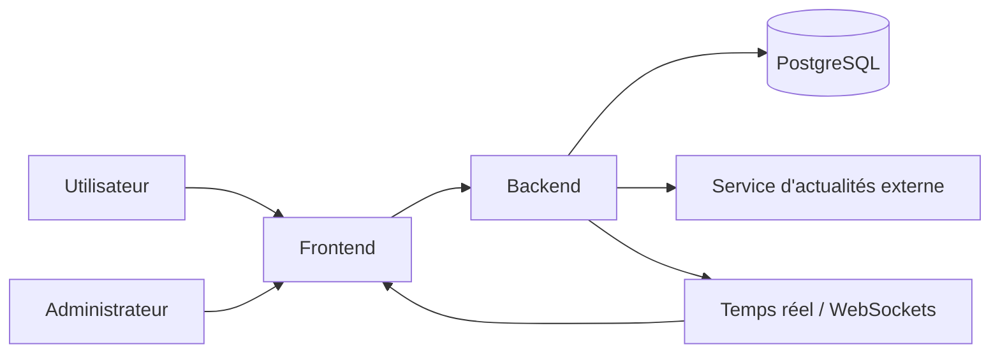
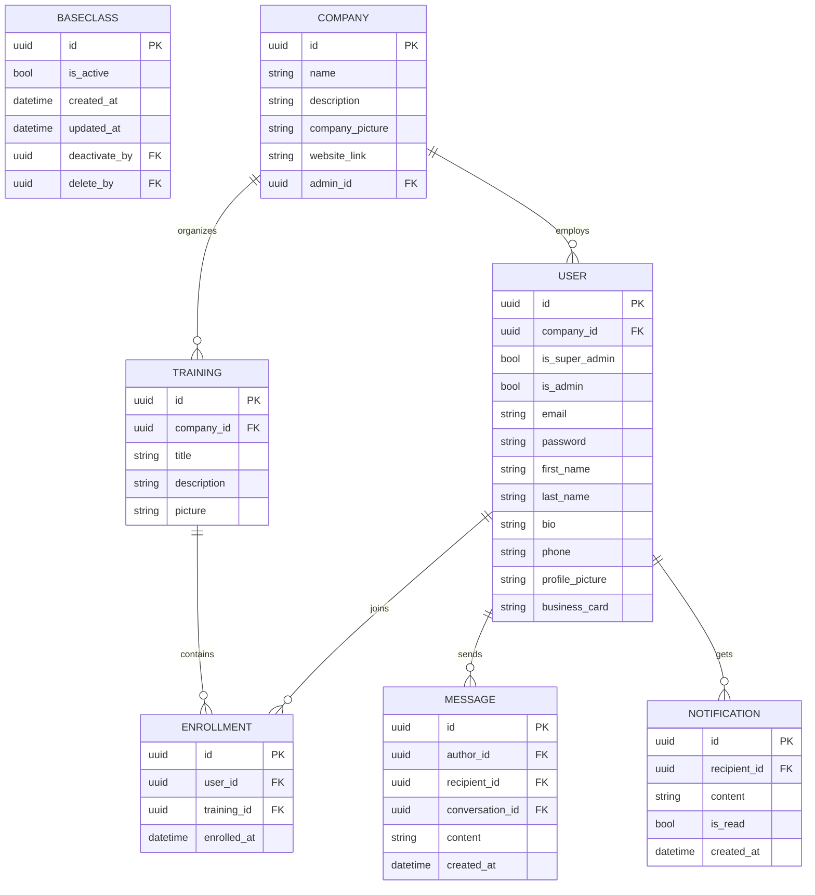
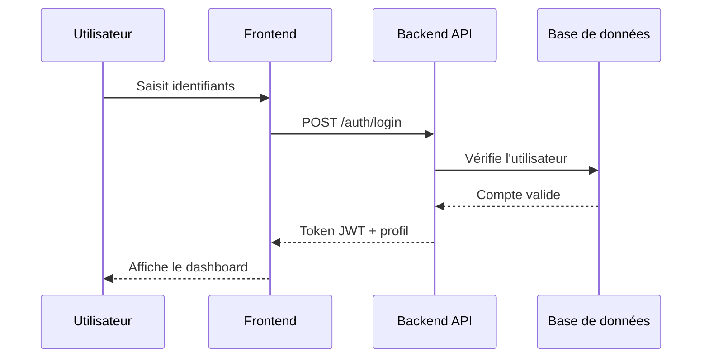
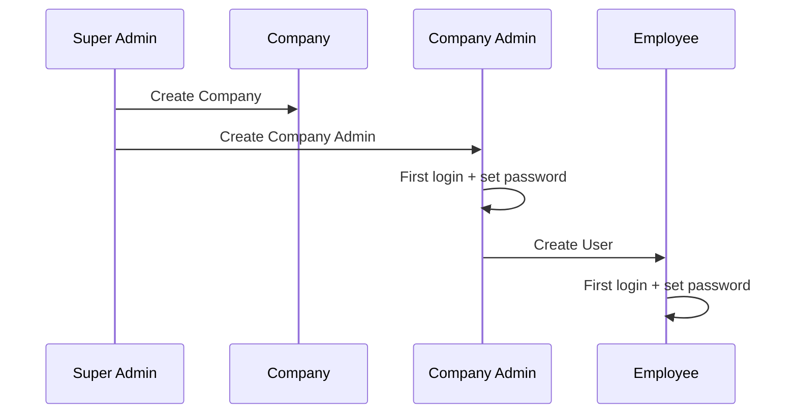
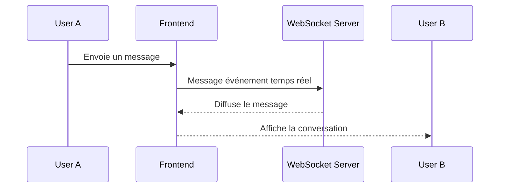

# Stage 3 — Documentation Technique

## 1. Objectif de l’étape

Cette étape transforme les objectifs du projet **Maison de l'Économie Dashboard** en un plan technique détaillé avant le développement du MVP.

La documentation doit couvrir :

- les user stories,
- les maquettes lorsque l’interface le nécessite,
- l’architecture du système,
- les classes, composants et structure des données,
- les diagrammes de séquence,
- les services et endpoints API,
- la stratégie SCM,
- la stratégie QA,
- les justifications techniques.

## 2. Contexte du projet

Le projet vise à créer une plateforme web centralisée pour les membres de **Maison de l'Économie** afin de :

- améliorer la communication entre entreprises et employés,
- centraliser les formations,
- diffuser des informations économiques,
- renforcer l’engagement des membres,
- limiter la dispersion des outils de communication.

Le besoin métier documenté dans les stages précédents montre que la solution doit être un **dashboard intégré**, utile à la fois pour les utilisateurs internes, les administrateurs et les équipes de gestion.

## 3. Équipe et rôles

L’équipe est composée de trois développeurs avec des rôles complémentaires :

- **Tom Vieilledent** : backend, API, base de données, sécurité, temps réel.
- **Nabil Zinini** : frontend, interface, intégration React, responsive design.
- **Florian Roosebeke** : intégration fullstack, coordination technique, QA, documentation.

La documentation et les validations client sont réalisées en équipe afin de garder la cohérence fonctionnelle et technique.

## 4. Vision produit et MVP

### 4.1 Vision

Créer un hub numérique pour la communauté Maison de l'Économie, capable de centraliser la communication, la formation et l’information économique.

### 4.2 Fonctionnalités MVP prioritaires

Les éléments prioritaires identifiés dans les documents du projet sont :

- authentification et autorisation,
- annuaire des entreprises et des employés,
- catalogue de formations,
- messagerie interne temps réel,
- actualités économiques,
- profils utilisateurs,
- recherche et filtrage,
- responsive design.

### 4.3 Fonctionnalités hors MVP

Les éléments reportés à une phase ultérieure sont :

- analytics avancées,
- gestion d’événements,
- partage de documents,
- application mobile native,
- multilingue,
- fonctionnalités sociales avancées,
- notifications temps réel avancées si elles complexifient le socle.

## 5. User Stories priorisées

La méthode de priorisation retenue est **MoSCoW**.

| Priorité    | User Story                                                                                                                  |
| ----------- | --------------------------------------------------------------------------------------------------------------------------- |
| Must Have   | En tant qu’utilisateur, je veux me connecter de manière sécurisée afin d’accéder à mon espace personnel.                    |
| Must Have   | En tant qu’utilisateur, je veux consulter l’annuaire des entreprises et des employés afin d’identifier les contacts utiles. |
| Must Have   | En tant qu’employé, je veux consulter les formations disponibles afin de progresser.                                        |
| Must Have   | En tant qu’utilisateur, je veux envoyer et recevoir des messages afin d’échanger avec d’autres membres.                     |
| Must Have   | En tant qu’utilisateur, je veux consulter des actualités économiques afin de rester informé.                                |
| Must Have   | En tant qu’administrateur, je veux gérer les utilisateurs et les entreprises afin d’administrer la plateforme.              |
| Should Have | En tant qu’utilisateur, je veux rechercher rapidement un contenu afin de gagner du temps.                                   |
| Should Have | En tant qu’utilisateur, je veux modifier mon profil afin de garder mes informations à jour.                                 |
| Could Have  | En tant qu’utilisateur, je veux recevoir des notifications pour les événements importants afin de ne rien manquer.          |
| Could Have  | En tant qu’administrateur, je veux consulter des statistiques d’usage afin de suivre l’adoption du produit.                 |
| Won’t Have  | En tant qu’utilisateur, je veux une application mobile native afin d’utiliser la plateforme sur téléphone.                  |

### 5.1 Maquettes

Le projet comporte une interface utilisateur, donc des maquettes sont applicables.

Les écrans à maquetter pour le MVP sont :

- page de connexion,
- tableau de bord,
- annuaire,
- page formations,
- messagerie,
- actualités,
- profil utilisateur,
- administration des comptes.

## 6. Architecture du système

L’architecture retenue dans la documentation est une architecture web classique avec séparation claire entre frontend, backend, base de données et temps réel.



### 6.1 Choix d’architecture

- **Frontend** : React pour l’interface et la navigation.
- **Backend** : API REST Flask pour les opérations métier.
- **Base de données** : PostgreSQL pour la persistance.
- **Temps réel** : WebSockets pour la messagerie.
- **Sécurité** : authentification JWT et contrôle par rôle.

## 7. Composants, classes et modèle de données

Les principaux composants métier identifiés sont :

- utilisateurs,
- entreprises,
- formations,
- inscriptions,
- messages,
- actualités,
- notifications.

### 7.1 Entités principales

- **User** : UUID, email utilisé comme identifiant de connexion Django, username aligné sur email, mot de passe, rôles admin, informations de profil, statut actif et champs d’audit.
- **Company** : UUID, nom, description, image, administrateur associé, statut actif et champs d’audit.
- **Training** : UUID, titre, description, image, statut actif et champs d’audit.
- **Enrollment** : relation entre un user et une formation.
- **Message** : auteur, destinataire ou salon, contenu, date.
- **Notification** : contenu, statut de lecture, destinataire.

#### BaseClass

Toutes les entités persistantes héritent d'une `BaseClass` contenant les champs communs et d'audit afin d'éviter la duplication et d'homogénéiser le modèle :

- `uuid` / `id` (PK)
- `is_active` (bool)
- `created_at` (datetime)
- `updated_at` (datetime)
- `deactivate_by` (uuid FK)
- `delete_by` (uuid FK)

Les entités `User`, `Company`, `Training`, `Enrollment`, `Message` et `Notification` héritent de `BaseClass` et ajoutent leurs attributs métier spécifiques.

### 7.2 Diagramme ER



### 7.3 Règles de conception

- un utilisateur appartient à une seule entreprise principale,
- une formation peut avoir plusieurs inscrits,
- une inscription ne doit pas être dupliquée,
- les messages doivent être traçables,
- les données doivent être filtrées par périmètre de visibilité.

## 8. Diagrammes de séquence

Les séquences de haut niveau documentent les interactions principales du système.

### 8.1 Connexion et accès au dashboard



### 8.2 Création d’une entreprise et activation des comptes



### 8.3 Messagerie temps réel



## 9. Spécifications API

### 9.1 API externes

La documentation du projet évoque une collecte ou consultation d’actualités économiques. Cette partie peut dépendre d’une API externe de news ou d’un flux source choisi par l’équipe.

Exigences générales :

- récupérer des actualités économiques,
- filtrer par sujet ou source,
- normaliser les données avant affichage.

### 9.2 API internes

Les endpoints internes doivent couvrir les fonctionnalités MVP.

#### Authentification

- `POST /auth/register`
- `POST /auth/login`
- `POST /auth/refresh`
- `POST /auth/logout`

#### Utilisateurs

- `GET /users/me`
- `PATCH /users/me`
- `GET /users`
- `GET /users/{id}`

#### Entreprises

- `POST /companies`
- `GET /companies`
- `GET /companies/{id}`
- `PATCH /companies/{id}`
- `DELETE /companies/{id}`

#### Formations

- `POST /trainings`
- `GET /trainings`
- `GET /trainings/{id}`
- `PATCH /trainings/{id}`
- `DELETE /trainings/{id}`
- `POST /trainings/{id}/join`
- `GET /me/trainings`

#### Messagerie

- `GET /messages`
- `POST /messages`
- `GET /conversations/{id}`
- `WS /chat`

### 9.3 Formats d’entrée et de sortie

Exemple de création d’utilisateur :

```json
{
  "first_name": "Guillaume",
  "last_name": "Salva",
  "email": "guillaume@example.com",
  "password": "secret"
}
```

Exemple de réponse :

```json
{
  "id": 12,
  "first_name": "Guillaume",
  "last_name": "Salva",
  "email": "guillaume@example.com",
  "role": "employee"
}
```

### 9.4 Contraintes de sécurité API

- authentification obligatoire sur les routes privées,
- contrôle d’accès par rôle,
- filtrage des données par entreprise,
- validation stricte des entrées,
- réponses d’erreur cohérentes.


# 10. Plan SCM (Gestion du code source)

| Élément | Explication simple |
|---|---|
| Dépôt Git | Projet stocké sur GitHub/GitLab avec un dossier `frontend` et un dossier `backend` |
| Branche `main` | Version finale utilisée en production |
| Branche `dev` | Branche utilisée pour le développement |
| `feature/*` | Branche pour développer une nouvelle fonctionnalité |
| `release/*` | Branche pour préparer une nouvelle version |
| `hotfix/*` | Branche pour corriger rapidement un bug important |
| Pull Request | Chaque modification doit être vérifiée avant d’être ajoutée au projet |
| Protection des branches | Impossible de modifier `main` et `dev` sans validation |
| Convention des commits | Messages de commits écrits de manière claire et organisée |
| Vérification automatique | Le code est testé automatiquement avant validation |
| Outils qualité | Utilisation d’outils pour formater et vérifier le code |
| Mise à jour dépendances | Dépendances mises à jour automatiquement |
| Changelog | Historique des modifications généré automatiquement |
| Documentation | Fichier expliquant comment est pensé le projet |
| Gestion des secrets | Les mots de passe et clés API ne sont jamais stockés dans le code |
| CI parallèle | Plusieurs tests lancés en même temps pour gagner du temps |

## Répartition des tâches

| Personne | Rôle |
|---|---|
| Tom | Développement backend et API |
| Nabil | Développement frontend et interface utilisateur |
| Florian | Intégration, QA, documentation et support fullstack |

---

# 11. Stratégie QA (Assurance Qualité)

| Domaine | Explication simple |
|---|---|
| Objectif QA | Assurer un projet fiable, sécurisé et rapide |
| Tests unitaires | Vérification des fonctions importantes du projet |
| Tests E2E | Simulation des actions utilisateur importantes |
| Tests de performance | Vérification que l’application reste rapide |
| Objectif performance | Temps de réponse API inférieur à 500 ms |
| Sécurité | Détection automatique des failles de sécurité |
| Observabilité | Surveillance des erreurs et performances |
| Alertes | Notification en cas de problème serveur |
| Environnement staging | Version de test proche de la production |
| Accessibilité | Vérification que le site est utilisable par tous |
| Sauvegardes | Sauvegarde régulière de la base de données |
| Rollback | Possibilité de revenir à une ancienne version |
| Smoke tests | Vérification rapide après chaque déploiement |
| Priorité qualité | Importance donnée à des tests utiles et fiables |

---

# Pipeline CI/CD simplifié

| Étape | Action |
|---|---|
| 1 | Vérification du code |
| 2 | Exécution des tests |
| 3 | Création du build |
| 4 | Vérification sécurité |
| 5 | Déploiement en staging |
| 6 | Validation finale |
| 7 | Déploiement en production |

### 11.1 Stratégie de test

- développement itératif,
- couverture des cas d’usage critiques en premier,
- revue des bugs avant chaque validation client,
- exploitation de Jest lorsque le projet frontend ou TypeScript le nécessite,
- documentation des incidents et des corrections.

## 12. Justifications techniques

Les décisions techniques sont justifiées par les besoins métiers documentés dans les stages précédents :

- centraliser l’information et la communication,
- livrer un MVP atteignable en 12 semaines,
- supporter le temps réel pour la messagerie,
- conserver une structure simple et maintenable,
- faciliter la montée en charge future,
- sécuriser les accès par entreprise et par rôle,
- permettre une validation régulière avec le client.

## 13. Conclusion

La Stage 3 formalise la préparation technique du projet Maison de l'Économie Dashboard. Elle synthétise les besoins métier, le scope MVP, les risques, les choix d’architecture et les exigences de qualité pour servir de base au développement.
