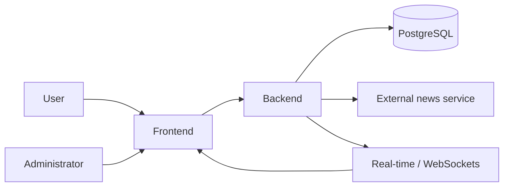
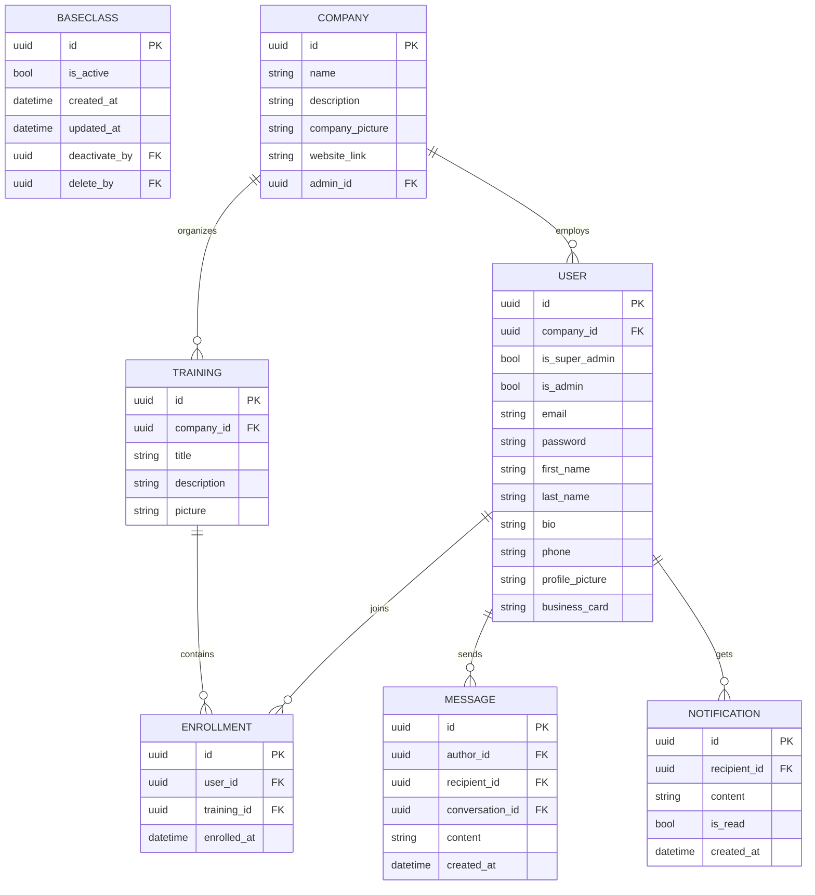
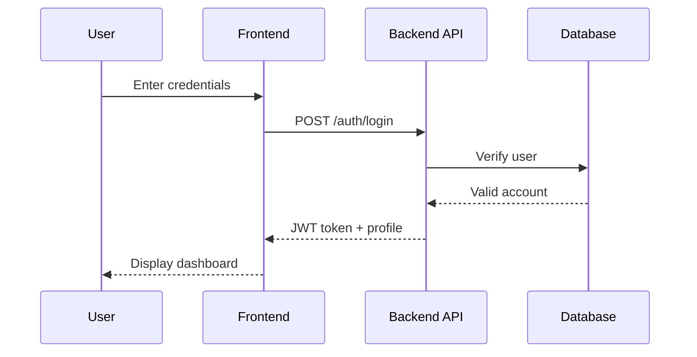
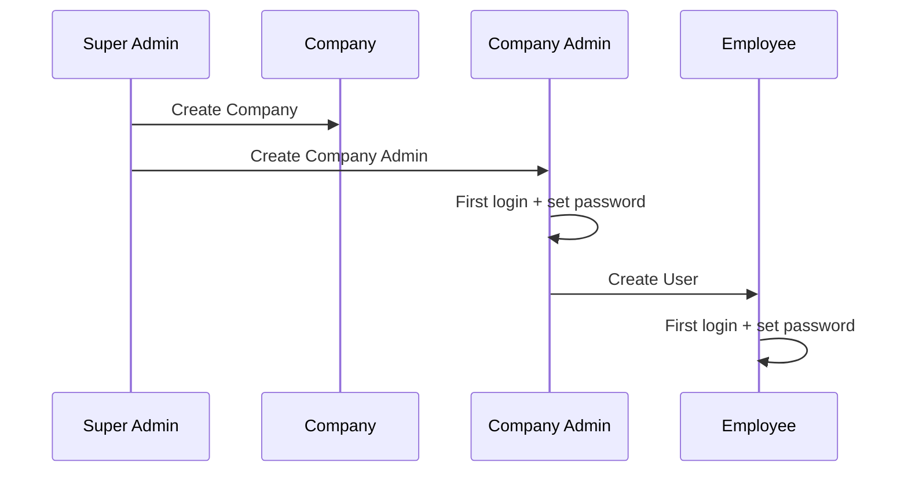
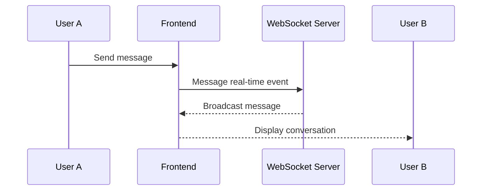

# Stage 3 — Technical Documentation

## 1. User Stories

The prioritization method used is **MoSCoW**.

| Priority    | User Story                                                                                |
| ----------- | ----------------------------------------------------------------------------------------- |
| Must Have   | As a user, I want to sign in securely so I can access my personal dashboard.              |
| Must Have   | As a user, I want to browse the company and employee directory to find useful contacts.   |
| Must Have   | As an employee, I want to view available trainings so I can improve my skills.            |
| Must Have   | As a user, I want to send and receive messages to communicate with other members.         |
| Must Have   | As a user, I want to read economic news so I can stay informed.                           |
| Must Have   | As an administrator, I want to manage users and companies to administer the platform.     |
| Should Have | As a user, I want to quickly search content to save time.                                 |
| Should Have | As a user, I want to update my profile to keep my information current.                    |
| Could Have  | As a user, I want to receive notifications for important events so I don't miss anything. |
| Could Have  | As an admin, I want usage statistics to track product adoption.                           |
| Won't Have  | As a user, I want a native mobile app for phone usage (out of scope for MVP).             |

## 2. Mockups

<table>
  <tr>
    <td></td>
    <td></td>
    <td></td>
  </tr>
  <tr>
    <td></td>
    <td></td>
    <td></td>
  <tr>
</table>

## 3. System Architecture

The chosen architecture is a standard web architecture with a clear separation between frontend, backend, database and real-time components.



### 3.1 Architecture Choices

- **Frontend**: React for UI and routing.
- **Backend**: REST API (Flask) for business operations.
- **Database**: PostgreSQL for persistence.
- **Real-time**: WebSockets for messaging.
- **Security**: JWT authentication and role-based access control.

## 4. Components, Classes and Data Model

Main business components identified:

- users,
- companies,
- trainings,
- enrollments,
- messages,
- news,
- notifications.

### 4.1 Main Entities

- **User**: UUID, email used as login identifier, username aligned with email, password, roles (admin flags), profile info, active status and audit fields.
- **Company**: UUID, name, description, picture, associated admin, active status and audit fields.
- **Training**: UUID, title, description, picture, active status and audit fields.
- **Enrollment**: relation between a user and a training.
- **Message**: author, recipient or room, content, timestamp.
- **Notification**: content, read status, recipient.

#### BaseClass

All persistent entities inherit from a `BaseClass` that centralizes common audit fields to avoid duplication and standardize the model:

- `uuid` / `id` (PK)
- `is_active` (bool)
- `created_at` (datetime)
- `updated_at` (datetime)
- `deactivate_by` (uuid FK)
- `delete_by` (uuid FK)

Entities (`User`, `Company`, `Training`, `Enrollment`, `Message`, `Notification`) extend `BaseClass` and add domain-specific attributes.

### 4.2 ER Diagram



### 4.3 Design Rules

- a user belongs to a single primary company,
- a training can have multiple enrollees,
- an enrollment must be unique per user/training pair,
- messages must be traceable,
- data must be filtered by visibility scope (company/role) where applicable.

## 5. Sequence Diagrams

High-level sequences document the main interactions.

### 5.1 Login and dashboard access



### 5.2 Company creation and account activation



### 5.3 Real-time messaging



## 6. API Specifications

### 6.1 External APIs

The project may consume or fetch economic news from external APIs or feeds. Requirements:

- fetch economic news,
- filter by topic or source,
- normalize data before display.

### 6.2 Internal APIs — CRUD endpoints detailed

General conventions:

- Pagination: `GET` list endpoints accept `?page=1&per_page=20`.
- Filtering: `?q=term`, field-specific filters (e.g. `?is_active=true`).
- Sorting: `?sort=created_at,-title` (`-` prefix for descending).
- Responses: standard `200`, `201`, `204`, `400`, `401`, `403`, `404`, `409`, `422`, `500`.
- Soft delete: `DELETE` marks `is_active=false` and populates `delete_by` and `deleted_at` if applicable.

#### Authentication

- `POST /auth/register` — Create a user account (public or admin).
  - Body: `{ first_name, last_name, email, password, company_id? }`
  - Response: `201` user object (without password).

- `POST /auth/login` — Returns JWT + refresh token.
  - Body: `{ email, password }`
  - Response: `200` `{ access_token, refresh_token, expires_in }`.

- `POST /auth/refresh` — Refresh tokens.
  - Body: `{ refresh_token }`
  - Response: `200` new tokens.

- `POST /auth/logout` — Invalidate refresh token / blacklist JWT.
  - Permissions: authenticated.

#### Users (`/users`)

- `GET /users` — Paginated list.
  - Query: `?page&per_page&q&company_id&is_active`.
  - Permissions: admin / company-admin (company-scoped).

- `POST /users` — Create user (admin action).
  - Body: `{ first_name, last_name, email, password, company_id, roles[] }`.
  - Response: `201` user object.

- `GET /users/{id}` — Retrieve user.
  - Permissions: self or admin/company-admin.

- `PATCH /users/{id}` — Partial update.
  - Body: partial fields.

- `PUT /users/{id}` — Replace user (optional).

- `DELETE /users/{id}` — Soft delete.

- `POST /users/{id}/reset-password` — Force password reset (admin) or change (self with old password).

#### Companies (`/companies`)

- `GET /companies` — Paginated list.
- `POST /companies` — Create a company.
  - Body: `{ name, description, website_link, company_picture, admin_id? }`.
- `GET /companies/{id}` — Company details.
- `PATCH /companies/{id}` — Partial update.
- `DELETE /companies/{id}` — Soft delete; business rules: disable related trainings, notify users.
- `GET /companies/{id}/users` — Company users list.

#### Trainings (`/trainings`)

- `GET /trainings` — List (filter by `company_id`, `is_active`).
- `POST /trainings` — Create training.
  - Body: `{ title, description, picture, company_id, is_active }`.
- `GET /trainings/{id}` — Details.
- `PATCH /trainings/{id}` — Partial update.
- `DELETE /trainings/{id}` — Soft delete.
- `POST /trainings/{id}/enroll` — Enroll the authenticated user (or admin on behalf of a user).
  - Body: `{ user_id? }` (omit to use current user).
  - Response: `201` enrollment object.
- `GET /trainings/{id}/enrollments` — List enrollees.
- `GET /users/{id}/trainings` — Trainings for a user.

#### Enrollments (`/enrollments`)

- `GET /enrollments` — Paginated list, filter by `user_id`, `training_id`.
- `POST /enrollments` — Create enrollment (admin).
  - Body: `{ user_id, training_id }`.
- `GET /enrollments/{id}` — Details.
- `PATCH /enrollments/{id}` — Update (status, dates).
- `DELETE /enrollments/{id}` — Remove/cancel enrollment.

#### Messaging and Conversations

Model: `Conversation` (room) contains participants; `Message` belongs to a conversation.

- `GET /conversations` — List conversations for the user.
- `POST /conversations` — Create a conversation/room.
  - Body: `{ title?, participant_ids: [uuid] }`.
- `GET /conversations/{id}` — Details (participants, last_messages).
- `PATCH /conversations/{id}` — Update (title, add/remove participants).
- `DELETE /conversations/{id}` — Delete or archive the conversation for the user.
- `GET /conversations/{id}/messages` — Paginated messages (`?before={message_id}&limit=50`).
- `POST /conversations/{id}/messages` — Send a message.
  - Body: `{ content, attachments? }`.
  - Response: `201` message object and broadcast via WS.
- `GET /messages` — Global message search (filters: `conversation_id`, `author_id`, `q`).
- `DELETE /messages/{id}` — Soft-delete or hide a message (policy dependent).
- `WS /ws/chat` — WebSocket endpoint for real-time events (message.create, message.update, presence).

#### Notifications (`/notifications`)

- `GET /notifications` — List for the user (`?is_read=false`).
- `POST /notifications` — (system/admin) create a notification.
- `PATCH /notifications/{id}` — Mark read / update.
- `DELETE /notifications/{id}` — Delete notification.

#### News / Feed (`/news`)

- `GET /news` — Retrieve normalized articles (`source`, `published_at`, `topic`).
- `GET /news/{id}` — Article details.
- `POST /news/sync` — (cron/admin) trigger synchronization from external sources.

### 6.3 Input / Output Formats

Examples (abridged):

Create User

```json
{
  "first_name": "Guillaume",
  "last_name": "Salva",
  "email": "guillaume@example.com",
  "password": "secret",
  "company_id": "uuid-company"
}
```

Create Company

```json
{
  "name": "Acme Corp",
  "description": "Company",
  "website_link": "https://acme.example"
}
```

Create Training

```json
{
  "title": "Project Management",
  "description": "Basic training",
  "company_id": "uuid-company"
}
```

Create Message

```json
{
  "content": "Hello",
  "attachments": []
}
```

Create Enrollment

```json
{
  "user_id": "uuid-user",
  "training_id": "uuid-training"
}
```

### 6.4 API Security Constraints

- authentication required for private routes,
- role-based access control (RBAC) and JWT scopes,
- company-level filtering to prevent multi-tenant data leaks,
- strict input validation (JSON Schema / pydantic),
- rate limiting on sensitive endpoints (auth, messages),
- anti-abuse measures for WS (auth, origin checks, per-connection limits),
- soft-delete and audit: store `created_by`, `updated_by`, `deactivate_by`, `delete_by` and timestamps,
- standardized error responses (RFC7807 problem+json),
- audit logging for sensitive operations (delete, role changes).

# 10. SCM Plan (Source Code Management)

| Item               | Simple explanation                                                    |
| ------------------ | --------------------------------------------------------------------- |
| Git repository     | Project stored on GitHub/GitLab with `frontend` and `backend` folders |
| `main` branch      | Production-ready branch                                               |
| `dev` branch       | Development branch                                                    |
| `feature/*`        | Branches for new features                                             |
| `release/*`        | Branches to prepare releases                                          |
| `hotfix/*`         | Branches for urgent bug fixes                                         |
| Pull Request       | All changes reviewed before merging                                   |
| Branch protection  | `main` and `dev` protected                                            |
| Commit conventions | Clear, structured commit messages                                     |
| CI checks          | Code tested automatically before merge                                |
| Quality tools      | Linters and formatters in CI                                          |
| Dependency updates | Automated dependency updates                                          |
| Changelog          | Automatically generated changelog                                     |
| Documentation      | Documentation explaining project decisions                            |
| Secrets management | No passwords or API keys in code                                      |
| Parallel CI        | Run tests in parallel to speed up pipeline                            |

## Task Distribution

| Person  | Role                                                 |
| ------- | ---------------------------------------------------- |
| Tom     | Backend & API development                            |
| Nabil   | Frontend & UI                                        |
| Florian | Integration, QA, documentation and fullstack support |

---

# 11. QA Strategy (Quality Assurance)

| Area                | Simple explanation                               |
| ------------------- | ------------------------------------------------ |
| QA Objective        | Ensure a reliable, secure and performant product |
| Unit tests          | Verify core functions                            |
| E2E tests           | Simulate key user flows                          |
| Performance tests   | Ensure application remains responsive            |
| Performance target  | API response time < 500 ms                       |
| Security            | Automated vulnerability scanning                 |
| Observability       | Monitor errors and performance                   |
| Alerts              | Notify on server issues                          |
| Staging environment | Test environment close to production             |
| Accessibility       | Ensure the site is usable by everyone            |
| Backups             | Regular database backups                         |
| Rollback            | Ability to revert to previous versions           |
| Smoke tests         | Quick checks after each deploy                   |
| Quality priority    | Focus on meaningful and reliable tests           |

---

# CI/CD Simplified Pipeline

| Step | Action               |
| ---- | -------------------- |
| 1    | Code checks          |
| 2    | Run tests            |
| 3    | Build artifact       |
| 4    | Security checks      |
| 5    | Deploy to staging    |
| 6    | Final validation     |
| 7    | Deploy to production |

### 11.1 Test Strategy

- iterative development,
- cover critical use-cases first,
- review bugs before client sign-off,
- use Jest for frontend/TypeScript when applicable,
- document incidents and fixes.

## 12. Technical Rationale

Technical choices are justified by the project's business needs:

- centralize information and communication,
- deliver an MVP reachable in ~12 weeks,
- support real-time messaging,
- keep a simple and maintainable structure,
- allow scalability,
- secure access by company and role,
- enable regular client validation.

## 13. Conclusion

Stage 3 formalizes the technical preparation for the Maison de l'Economie Dashboard project. It synthesizes business needs, the MVP scope, risks, architecture decisions and quality requirements to serve as a development baseline.
