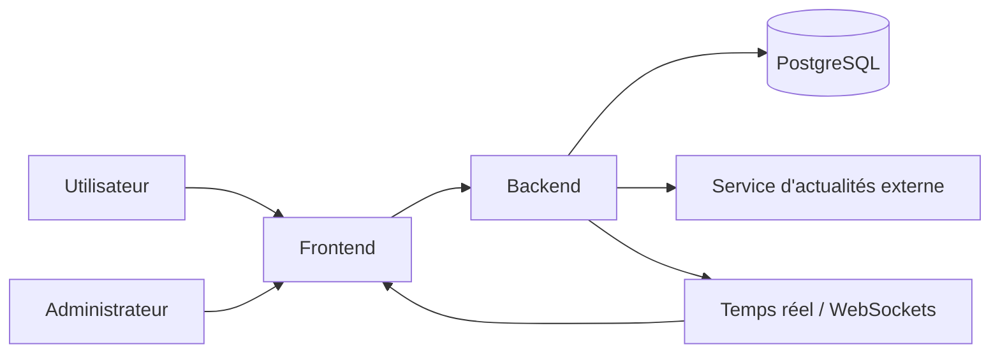

# Stage 3 — Documentation Technique

## 1. User Stories

La méthode de priorisation retenue est **MoSCoW**.

| Priorité    | User Story                                                                                                                  |
| ----------- | --------------------------------------------------------------------------------------------------------------------------- |
| Must Have   | En tant qu’utilisateur, je veux me connecter de manière sécurisée afin d’accéder à mon espace personnel.                    |
| Must Have   | En tant qu’utilisateur, je veux consulter l’annuaire des entreprises et des employés afin d’identifier les contacts utiles. |
| Must Have   | En tant qu’employé, je veux consulter les formations disponibles afin de progresser.                                        |
| Must Have   | En tant qu’utilisateur, je veux envoyer et recevoir des messages afin d’échanger avec d’autres membres.                     |
| Must Have   | En tant qu’utilisateur, je veux consulter des actualités économiques afin de rester informé.                                |
| Must Have   | En tant qu’administrateur, je veux gérer les utilisateurs et les entreprises afin d’administrer la plateforme.              |
| Should Have | En tant qu’utilisateur, je veux rechercher rapidement un contenu afin de gagner du temps.                                   |
| Should Have | En tant qu’utilisateur, je veux modifier mon profil afin de garder mes informations à jour.                                 |
| Could Have  | En tant qu’utilisateur, je veux recevoir des notifications pour les événements importants afin de ne rien manquer.          |
| Could Have  | En tant qu’administrateur, je veux consulter des statistiques d’usage afin de suivre l’adoption du produit.                 |
| Won’t Have  | En tant qu’utilisateur, je veux une application mobile native afin d’utiliser la plateforme sur téléphone.                  |

## 2. Maquette

## 3. Architecture du système

L’architecture retenue dans la documentation est une architecture web classique avec séparation claire entre frontend, backend, base de données et temps réel.

### 6.1 Choix d’architecture

- **Frontend** : React pour l’interface et la navigation.
- **Backend** : API REST Flask pour les opérations métier.
- **Base de données** : PostgreSQL pour la persistance.
- **Temps réel** : WebSockets pour la messagerie.
- **Sécurité** : authentification JWT et contrôle par rôle.
