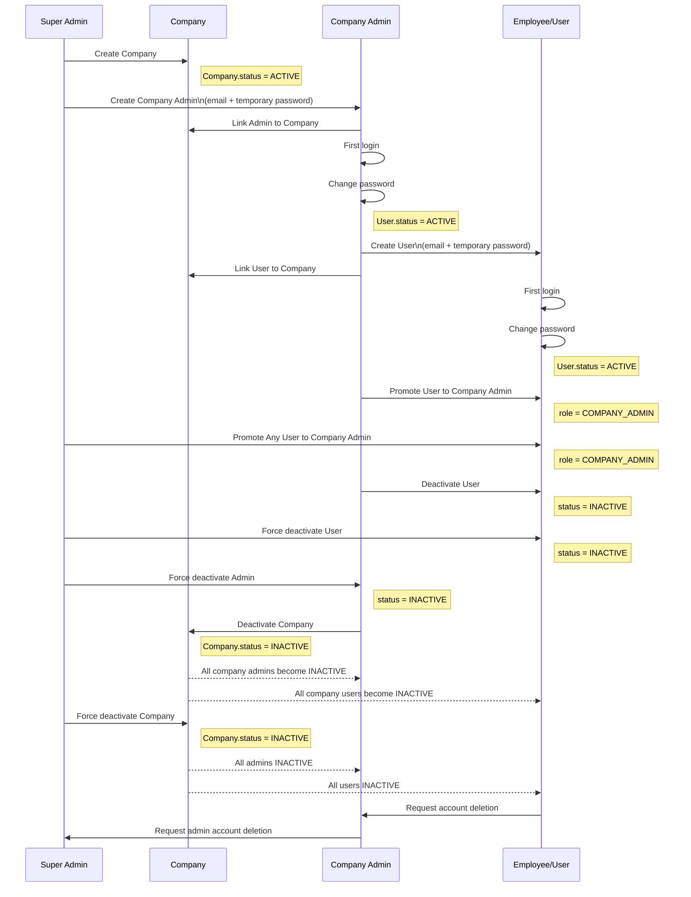

```mermaid
sequenceDiagram

    participant SA as Super Admin
    participant C as Company
    participant A as Company Admin
    participant U as Employee/User

    %% =====================================================
    %% COMPANY CREATION
    %% =====================================================

    SA->>C: Create Company
    Note right of C: Company.status = ACTIVE

    SA->>A: Create Company Admin\n(email + temporary password)
    A->>C: Link Admin to Company

    %% =====================================================
    %% ADMIN ACTIVATION
    %% =====================================================

    A->>A: First login
    A->>A: Change password
    Note right of A: User.status = ACTIVE

    %% =====================================================
    %% USER CREATION
    %% =====================================================

    A->>U: Create User\n(email + temporary password)
    A->>C: Link User to Company

    U->>U: First login
    U->>U: Change password
    Note right of U: User.status = ACTIVE

    %% =====================================================
    %% ADMIN MANAGEMENT
    %% =====================================================

    A->>U: Promote User to Company Admin
    Note right of U: role = COMPANY_ADMIN

    SA->>U: Promote Any User to Company Admin
    Note right of U: role = COMPANY_ADMIN

    %% =====================================================
    %% USER MANAGEMENT
    %% =====================================================

    A->>U: Deactivate User
    Note right of U: status = INACTIVE

    SA->>U: Force deactivate User
    Note right of U: status = INACTIVE

    %% =====================================================
    %% ADMIN MANAGEMENT BY SUPER ADMIN
    %% =====================================================

    SA->>A: Force deactivate Admin
    Note right of A: status = INACTIVE

    %% =====================================================
    %% COMPANY DEACTIVATION
    %% =====================================================

    A->>C: Deactivate Company
    Note right of C: Company.status = INACTIVE

    C-->>A: All company admins become INACTIVE
    C-->>U: All company users become INACTIVE

    %% =====================================================
    %% SUPER ADMIN OVERRIDE
    %% =====================================================

    SA->>C: Force deactivate Company
    Note right of C: Company.status = INACTIVE

    C-->>A: All admins INACTIVE
    C-->>U: All users INACTIVE

    %% =====================================================
    %% ACCOUNT DELETION REQUESTS
    %% =====================================================

    U->>A: Request account deletion
    A->>SA: Request admin account deletion

```